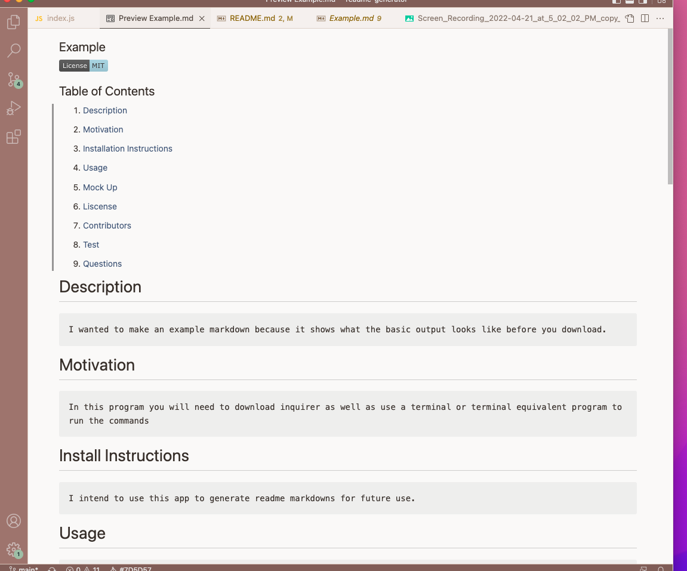

## readme-generator

## Table of Contents

1. [Description](#description)

2. [Motivation](#motivation)

3. [Installation Instructions](#installation-instructions)

4. [Usage](#usage)

5. [Mock Up](#mock-up)

6.[Future](#future)

6. [Liscense](#license)

7. [Questions](#questions)

# Description

    this is a README generator for you to use. This generator will take in information that you put in and then according to that information output a generated readme with all of the user inputs.

# Motivation

> I wanted to make a read me generator to understand how node.js and make a more convienient way to create a unique professional readme in a convienient way.

# Install Instructions

In order to use this readme generator you would have to...
    * this can be done through terminal or terminal equivalent places (VSCODE, terminal, gitbash)

1. Run this command thorugh the appropriate file path you have cloned it to

2. install the npm package of inquierer

3. inside of the cloned folder run the code of

    node index.js

4. answer the premade questions

5. It will then generate a read me

NOTE: if your liscence is not located on the same level as the .md file it will nor link properly! Please make sure that they are both on the same level. It also should be noted that it does take a second for your GIF and image to load onto the read me! If ther eis anything that you did not need please remove.

> I have included an exapmple read me to see what your outut should look like!

# Usage

* The intention of this app is to generate a professional read me file with all of the users input with premade markdown attributes that can be edited to fit the user's purpose later.

# Mock Up

I have included a demo link to this mock up [here](https://drive.google.com/file/d/1mI7fn2DPPsW7cYRJdx1vKf_0m0nEn8tI/view 
)

# Future

    I think in the future I would like to add options where the user is prompted to ask yes or no if they would want to include certain areas which would be more interactive.

# License

* [MIT License](./LICENSE)

# Questions

If you have any questions do not heasitate to reach out!
brookelovedevelops@outlook.com |
[brookelove Github](https://github.com/brookelove)